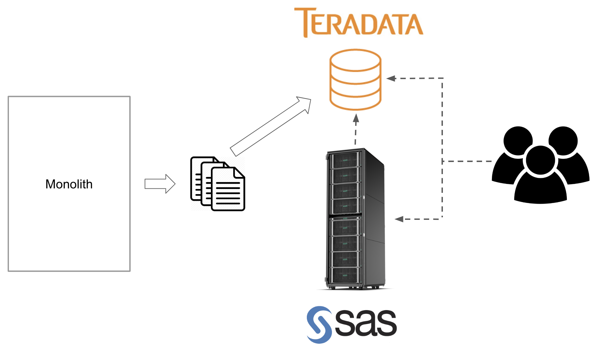
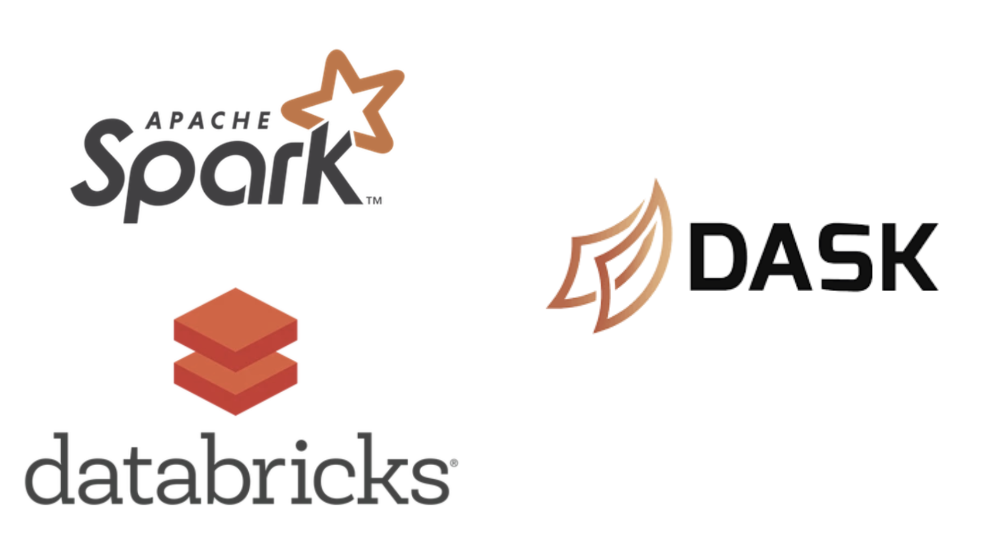

## The Good and the Bad of Moving an Enterprise Data Ecosystem to the Cloud


**Ian Whitestone**

*Data + Finance Panel*

September 20, 2018

note: DS at Capital One. Start off with some background on who we are and what we do, then dive into our journey into the cloud.

--- 

## Let's travel back to the early 1990s...


Where credit cards were a *one-size-fits-all pricing approach*

note: to understand who capital one is, you need to go back to the 1990s when they were founded || little differentiation in the card industry


## And meet our founders


note: our two founders came along and were quite surprised as they saw two big opportunities


## Who saw some opportunities


## Who saw some opportunities


## And made some hypotheses
*But what if...*


note: c1 leveraged the power of data and statistical testing to create personalized offers to customers are the right time, and the right price


## That turned out pretty well

- some stats about C1 today


## And explains why data is the heart of our business
Our business is run by data driven decision making
<hr>

- Marketing decisioning
- Underwriting models
- Fraud defenses
- A/B testing
- Customer experience deep dives
- Controls and monitoring

---

## Our on-prem data ecosystem had served us well


note: this architecture still makes sense for a lot of things, but overall will not allow organizations to deliver game-changing results and customer experiences


## Until a few years ago, our CEO said


note: full disclosure...not drawing any comparisons


## A Brave New World


note: monoliths to microservices || batch extracts to RLDB, to SDP & data lake || subset of data to Snowflake || as you can imagine, many consumer new access patterns emerge..


## A Brave New World


## A Brave New World


## A Brave New World


## A Brave New World


---

## Life in the Cloud is Good

- centralized, shared servers to custom EC2s & containers
- models deployed by tech teams on limited server to self-managed containerization & deployment
- batch processes to realtime
- rigid data schemas to highly flexible
- more data
- database to true source

note: here are some core shifts in data design patterns


## There are lots of new tools


## There are lots of new tools




## There are lots of new tools


<hr>

- separate compute and storage
- each LOB manages own warehouse
- easily load data from S3 buckets
- more complicated data structures


## So whats the catch?

---

## It's not all smooth sailing

* Migration effort
* Access management and controls
* Data management
* Cost Control

note: While the cloud brings a ton of benefits over more traditional, on-prem environments, there are a lot of challenges big organizations will face when moving their data ecosystems.


## Migration effort
1. Huge effort from tech teams
2. Significant effort from the business to migrate a large number of models, controls, monitoring, other processes etc.
3. Skill gaps with the new technology


## Access Management & Controls
- Unleashing 1000s of users in an AWS account(s)
    - How do you control which EC2 instance belongs where
    - Lots of new security risks..like accidentally modifying a bucket policy

```json
{
  "Version":"2012-10-17",
  "Statement":[
    {
      "Sid":"AddPerm",
      "Effect":"Allow",
      "Principal": "*",
      "Action":["s3:GetObject"],
      "Resource":["arn:aws:s3:::examplebucket/*"]
    }
  ]
}
```


## Access Management & Controls
- Banks must retain very sensitive data
	- Credit card numbers
	- Personal information
		- Names, DOBs, addresses, SIN numbers, phone numbers
	- Bureau data
- Which requires strict access controls surrounding who can access what


## Access Management & Controls
*When everything is primarily in one database, this is easy:*

```sql
CREATE TABLE customers (
	acct_id NUMBER(38,0),
	product_id NUMBER(4,0),
	open_dt DATE,
	name VARCHAR(100),
	address_line_1 VARCHAR(200),
	address_line_2 VARCHAR(200),
	postal_code CHAR(6),
	date_of_birth DATE
);

GRANT SELECT ON customers TO <role_with_npi>;

CREATE VIEW customers_scrubbed AS (
	SELECT acct_id, product_id, open_dt, postal_code
	FROM customers
);

GRANT SELECT ON customers_scrubbed TO <role_without_npi>;
```


## But in the cloud, this becomes more challenging
- Data is generally commingled (like the customers table above)
- Amazon's IAM service allows for object level access controls

```json
{
  "Version": "2012-10-17",
  "Statement": [
    {
      "Effect": "Allow",
      "Principal": {
        "AWS": ["arn:aws:iam::111122223333:user/Alice",
                "arn:aws:iam::111122223333:user/Bob"
            ]
      },
      "Action": "s3:GetObject",
      "Resource": ["arn:aws:s3:::my_bucket/some_folder/database_extract*",
                   "arn:aws:s3:::my_bucket/another_folder/other_extract*"]
    }
  ]
} 
```


## Data Management
- Metadata management & data discovery becomes more difficult in a de-centralized system
- We have moved from Teradata to many different data sources:
	- S3
	- Application owned databases (AWS RDS)
	- Redshift
	- Snowflake
	- Kafka
- Flexible data storage locations (i.e. S3 data lake) allow for data producers to update schemas more frequently


## And lastly... cost control


note: AWS' GUI, combined with the accessiblity of infrastructure automation scripts makes it really easy to create & access compute.

---

## Some closing thoughts

Make investements early on in the migration process
<hr>

- education & training
- data infrastructure & tooling
	- metadata management
	- data movement & access
	- managing & provisioning compute


## Some closing thoughts

Take a cloud migration as an opportunity to rethink core aspects of business
<hr>

- rationalize, justify and rethink your core controls, processes and models
- Lift & shift VERSUS rebuild
