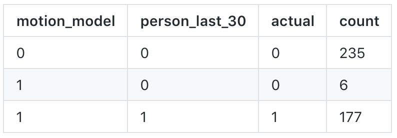

# Who's There? 
## Building a home security system with Pi & Slack!

<!--  -->


**Ian Whitestone**

**PyCon Canada 2018**

note:


## Follow Along?

**Slides:** <a href="https://ian-whitestone.github.io/slides/pycon-canada-2018.html">ianwhitestone.work/talks</a>

**Repo:** <a href="https://github.com/ian-whitestone/rpi-security-system">github.com/ian-whitestone/rpi-security-system</a>

---

# So you bought a pi...

* And it came with a camera...  <!-- .element: class="fragment" -->
* And it sat in a drawer for two years  <!-- .element: class="fragment" -->

---

## Home Security System Requirements

* Detect & Alert <!-- .element: class="fragment" -->
* Interact with system <!-- .element: class="fragment" -->
* Monitor system <!-- .element: class="fragment" -->

note: Today I will walk you through how I solved each of these components


## Let's start with a demo


<center>
    <video controls="true" autoplay="false" loop="true" muted="true" height="650" src="imgs/pycon/pycam_on_demo.mov"></video>
</center>

note: 


<center>
    <video controls autoplay="false" loop="false" muted="true" height="650" src="imgs/pycon/last_image_demo.mov"></video>
</center>

note: 


<center>
    <video controls autoplay="false" loop="true" muted="true" height="650">
       <source src="imgs/pycon/demo_2.mp4" type="video/mp4"> Your browser does not support the video tag.
    </video>
</center>

note: alerts are also communicated via slack, and users can tag images for future model improvements

---

# Motion Detection


## Motion detection with Background Subtraction

* Store a model of the "background" <!-- .element: class="fragment" -->
* Compare new images to this background model <!-- .element: class="fragment" -->
* Infer that large differences are caused by motion <!-- .element: class="fragment" -->


To illustrate an example of this, consider the following background model image:


note: The background image is a blurred, black and white image. Blurring helps reduce noise, while working with black and white images is less computationally heavy. RGB values don't add much value in motion detection.


Next, we take our latest frame,


Then blur it and convert it to black and white so it can be compared to our background image.


Taking the difference between the two frames yields the following "delta" image:


Next, we threshold (or binarize) the image, by converting all pixels above/below a certain threshold to white or black. 


Dilation is then performed to close any gaps. Dilation involves moving a sliding window (kernel) over an image, and updating a given pixel's value based on the surrounding pixels.


`if white_blobs == big:`
<br>
`alert()`

note: From this thresholded, dilated difference, you can see if the area of the white blobs is greater than a certain threshold, and trigger motion based of that.


You can see how all this is layered together in the demo below.

<center>
    <video controls autoplay="false" loop="false" muted="true" height="650" src="imgs/pycon/background_subtraction_demo.mov"></video>
</center>

note: This method of background subtraction was entirely based off of a blog post by Adrian Rosebrock over at pyimagesearch.com. Check out the references section at the bottom for a link to his post.

---

# Slack as an interface


* slack is awesome
* slack has some amazing APIs
* slack works on mobile and desktop
* I don't need to code a GUI


## Interaction through slash commands

entering `/pycam_on` in slack sends a post request to a Flask function


```python
@app.route('/pycam_on', methods=["POST"])
@slack_verification()
def pycam_on():
    """Turn on the pycam process.

    Returns:
        str: Response to slack
    """
    if utils.redis_get('camera_status'):
        response = 'Pycam is already running'
    else:
        utils.redis_set('camera_status', True)
        response = "Pycam has been turned on"
    return response
```

note: decorator ensures the request is coming from slack, since slack sends a unique, private token with each request


## More slash commands


## What if I don't want to manually turn the system on/off?


### Turns out my router has an API..


```python
import requests

# Create a new requests session
session = requests.session()

# Call the login API with my credentials
response = session.post('<router_login_api_url>', LOGIN_DATA)

# Update my cookie with the new, authenticated user_id
user_str = response.headers['Set-Cookie']
user_id = user_str.split(';')[0].split('userid=')[1]
new_cookie = BASE_COOKIE.format(USERNAME, PWD, user_id)
headers['Cookie'] = new_cookie

# Call api and get connected devices
response = session.get('<get_connected_devices_api_url>', headers=headers)
devices = response.json()
connected_devices = [d['hostName'] for d in devices]
```

---

# Architecture


### But how do you make sure all that stuff is running?
<hr>
### Enter <a href="https://github.com/nicolargo/glances">glances</a>.


---

# Reducing False Positives


note: talk about how it fails in inconsistent lighting conditions


~~`do_deep_learning()`~~
<br>
**download pre-trained image classifier model**


```python
import cv2

# Load model
net = cv2.dnn.readNetFromCaffe(proto_file, caffe_model_file)

# Get classifications
net.setInput(img)
classifications = net.forward()
```


## Results



---

# Wrapping up


## If you actually care about home security...

you should probably buy an actual home security system <!-- .element: class="fragment" -->
  
note: HOWEVER, if you want to learn a bit about flask web dev, slack bots, OpenCV and image processing, networking, application monitoring....playing with a raspberry pi is a pretty awesome experience!


## More important things than home security
<hr>

* Are there leftovers in the company kitchen?
* Did my neighbors dog shit on my lawn?
* Did my roommate take my beer?


## Thank you python community...

you allowed me to build a home security system with:

<ul> <!-- .element: class="fragment" -->
    <li> no computer science background </li>
    <li> no idea how to build APIs or a web app </li>
    <li> no idea how motion detection works </li>
<ul>

---

## Other stuff I didn't have time to show


