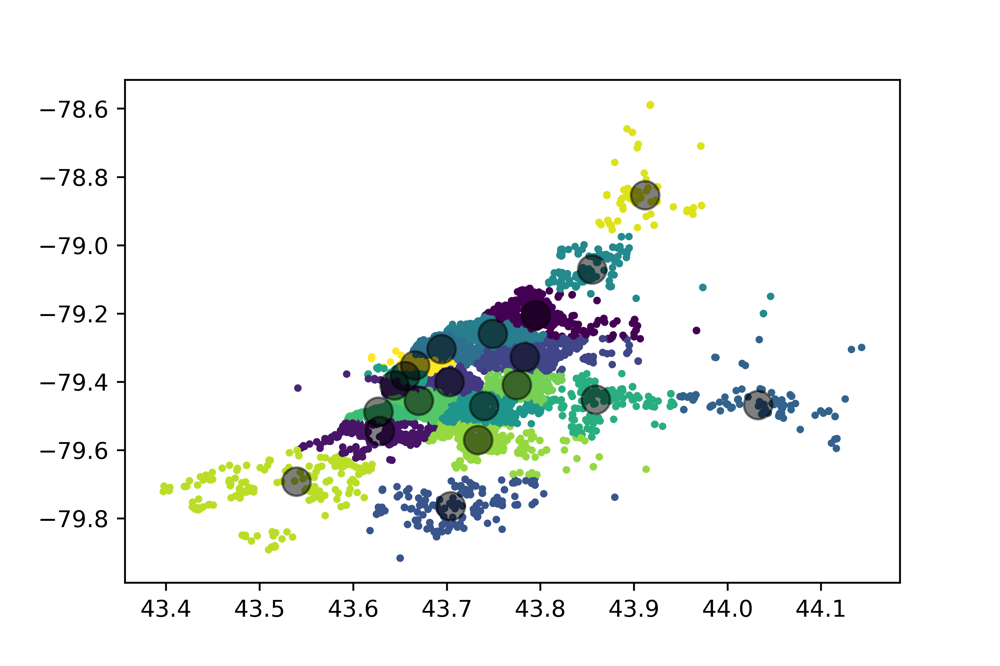
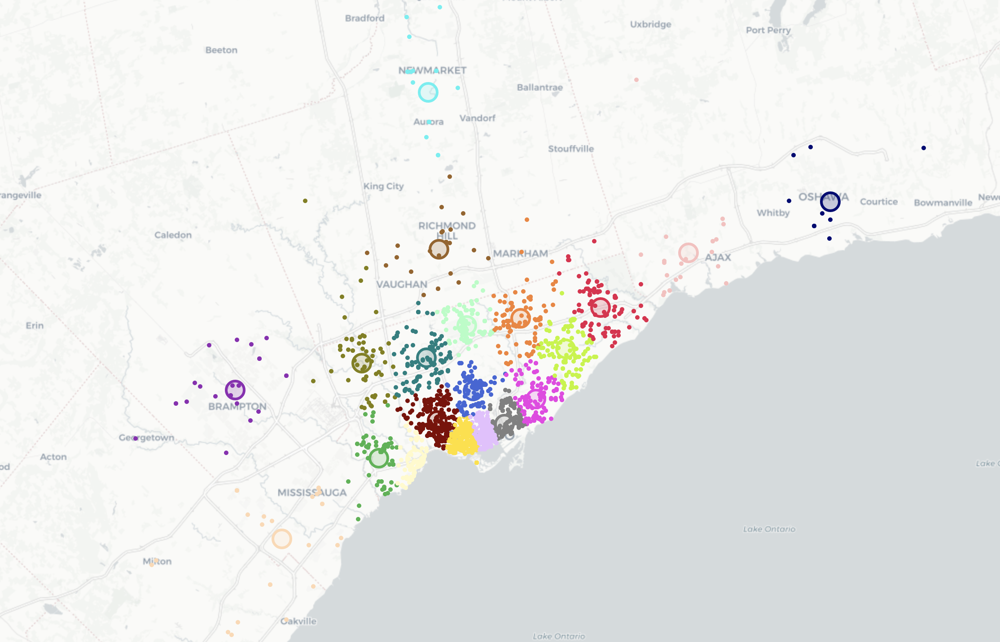
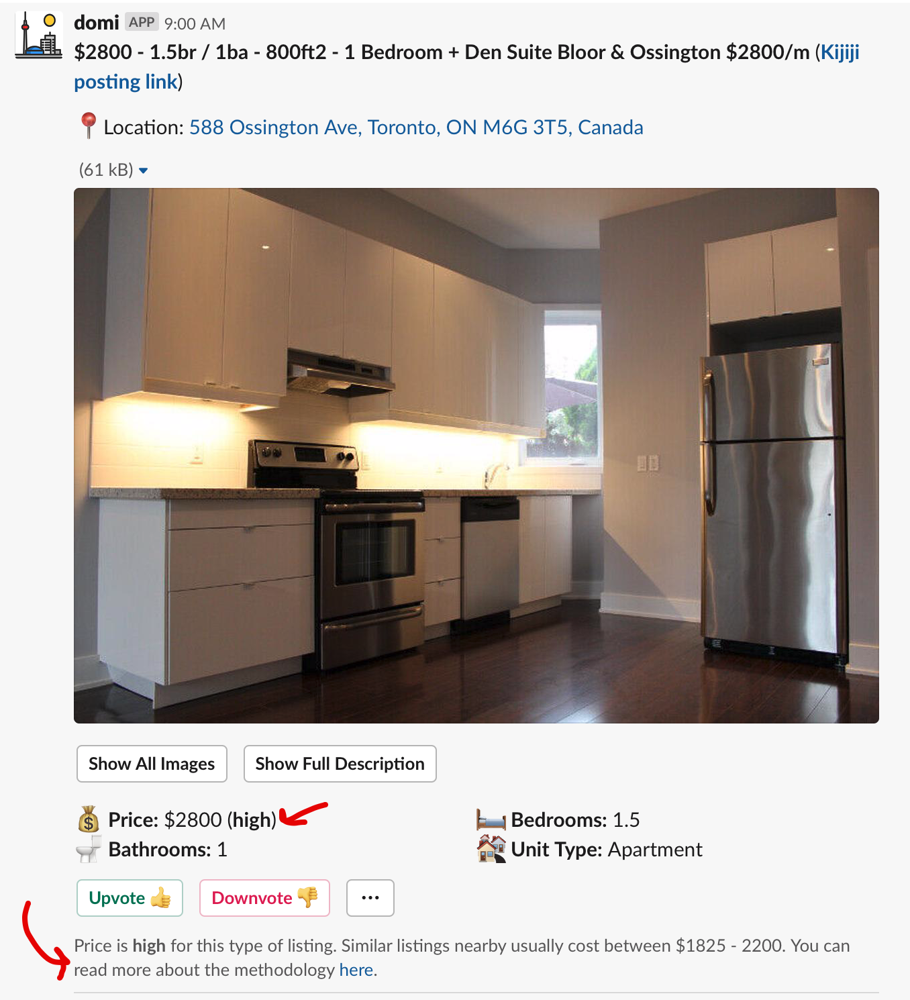

## Gimme Shelter:
## Using Python to Find a Place to Live in Toronto

<!-- # 🐍 🔍 🏠 -->

<!--  -->

<!--  -->


**PyCon Canada - November 2019**

*Ian Whitestone*

note: hey everyone, my name is Ian & I work on the data team at Shopify. today I am going to talk about a Python library called Zappa which makes doing serverless things 100 times easier. for the record, this has talk has nothing to do with Shopify or what I do at Shopify, but if people are curious about what type of stuff we do on the data team we should catch up after.


<hr>
<p> 
    
    
</p>
<hr>
Today's slides 👉 [ianwhitestone.work/slides](https://ianwhitestone.work/slides/pycon-canada-2019.html)

---

## Some background..


#### `>>> df[df.bedrooms == 1].price.median()`

`$2,200` <!-- .element: class="fragment" --> 

 <!-- .element: class="fragment" --> 

note: xxx


#### `>>> df[df.bedrooms == 0].price.median()`

`$1,800` <!-- .element: class="fragment" --> 

 <!-- .element: class="fragment" --> 


#### `>>> df[df.housing_type == 'basement'].price.median()`

`$1,500` <!-- .element: class="fragment" --> 

 <!-- .element: class="fragment" --> 


## Not only is it expensive..

* constantly looking on multiple sites
* listings go really fast
* competitive applications
* bidding wars
* ...


## Maybe there's a better way?

Inspired by a simple San Francisco [apartment posting slack bot](https://www.dataquest.io/blog/apartment-finding-slackbot/) made by Vik Paruchuri...

---

## hello, domi


<center>
    <video controls="true" muted="true" height="700px" src="imgs/pycon-canada-2019/clips/preferences.mp4"></video>
</center>


<center>
    <video controls="true" muted="true" height="700px" src="imgs/pycon-canada-2019/clips/pull_listing.mp4"></video>
</center>

---

## Today's talk

* Quick overview of how it works & highlight some packages
* Deep dive into the price rank feature
* Lesson's learned

---

## Overview of domi


## All lambda functions are managed through Zappa


<hr>

*"Zappa makes it super easy to build and deploy server-less, event-driven Python applications (including, but not limited to, WSGI web apps) on AWS Lambda + API Gateway"*

note: First published in July 2016, packed with useful features


`zappa_settings.json` 

```json
{
    "web_scraper": {
        "project_name": "domi",
        "runtime": "python3.7",
        "s3_bucket": "domi",
        "events": [{
           "function": "main.run_my_program",
           "expression": "rate(1 hour)"
        }]
    }
}
```


```bash
→ zappa deploy web_scraper
Calling deploy for stage web_scraper..
Downloading and installing dependencies..
 - psycopg2-binary==2.8.3: Using locally cached manylinux wheel
 - sqlite==python3: Using precompiled lambda package
'python3.7'
Packaging project as zip.
Uploading zappa-domi-web-scraper-1569183776.zip (9.5MiB)..
100%|█████████████████████████████████████████| 9.97M/9.97M [00:21<00:00, 528KB/s]
Scheduling..
Scheduled zappa-domi-web-scraper.run with expression rate(1 hour)!
Deployment complete!
```


## Learn more about Zappa

* [github.com/Miserlou/Zappa](https://github.com/Miserlou/Zappa) 
* [Sean Coates - PyCon Canada 2017](https://www.youtube.com/watch?v=gSae_ZBBbkc)
* [ianwhitestone.work/slides/python-meetup-sept-2019.html](https://ianwhitestone.work/slides/python-meetup-sept-2019.html)


## Plenty of existing resources for scraping


## Web data is usually messy, and deeply nested

```
data = {
  "config": {
    "adData": {
      "price": {"amount": "2000000"},
      "title": "Gorgeous 2 Bed 2 Bath Fully Furnished Executive Condo",
      "description": "Stunning Executive Fully Furnished Lower Penthouse...",
      ...
      "media": [
        {
          "type": "image",
          "href": "https://i.ebayimg.com/00/s/NjAwWDgwMA==/z/BTsAAOSwhZhdpb8X/$_59.JPG",
        },
        ...
      ],
      "adLocation": {"latitude": 43.6500917, "longitude": -79.38737379999999},
      "adAttributes": [
        {
          "machineKey": "numberbedrooms",
          "machineValue": "2.5",
          ...
        }
        ...
      ],
      ...
  }
}
```


## And correspondingly, processing it is equally messy

```python
price = data["config"]["adData"]["price"]["amount"]
price = int(price) / 1000
latitude = data["config"]["adData"]["adLocation"]["latitude"]
longitude = data["config"]["adData"]["adLocation"]["longitude"]
imgs = [
    media["href"] for media in data["config"]
]
```


<div class="container">
    <div class="col">
        <h2> Enter glom </h2>
        [github.com/mahmoud/glom/](https://github.com/mahmoud/glom/)
        <br>
        ...a new approach to working with data in Python
    </div>
    <div class="col">
        
    </div>
</div>
<hr>

* Path-based access for nested structures <!-- .element: class="fragment" --> 
* Declarative data transformation using lightweight, Pythonic specifications <!-- .element: class="fragment" --> 
* Readable, meaningful error messages <!-- .element: class="fragment" --> 


```python
>>> from glom import glom

>>> data = {
    'config': {
        'adData': {
            'price': {'amount': '2000000'}
        },
        ...
    }
}
>>> glom(data, 'config.adData.price.amount')
'2000000'
```


```python
>>> from glom import glom

>>> data = {
    'config': {
        'adData': {
            'price': {'amount': '2000000'}
        },
        ...
    }
}
>>> glom(data, ('config.adData.price.amount', lambda x: int(x) / 1000))
2000
```


```python
>>> from glom import glom

>>> data = {
    'config': {
        'adData': {
            'price': {'amount': '2000000'}
        },
        "adLocation": {
            "latitude": 43.6500917, 
            "longitude": -79.38737379999999
        },
        ...
    }
}
>>> spec = {
    "price": ("config.adData.price.amount", lambda x: int(x)/1000),
    "latitude": "config.adData.adLocation.latitude",
    "longitude": "config.adData.adLocation.longitude"
}
>>> glom(data, spec)
{
    "price": 2000,
    "latitude": 43.6500917,
    "longitude": -79.38737379999999
}
```


* [PostGIS](https://postgis.net/) is a spatial database extender for [PostgreSQL](https://postgresql.org) object-relational database 
* It adds support for geographic objects allowing location queries to be run in SQL


## Run fast, powerful spatial queries

```sql
SELECT listings.*
FROM listings, user_location_preferences
WHERE 
    /* listing is within area user drew */
    ST_Contains(user_location_preferences.geom, listings.geom)
    /* And meets other constraints */
    AND bedrooms >= 1
    AND bathrooms >= 1
    AND price < 5000
```


```python
from models import Listing, UserRegion, SESSION
from sqlalchemy import func

listings = (
    SESSION.query(
        Listing.id,
        Listing.source,
        Listing.price,
        ...
    )
    .join(Listing)
    .join(
        UserRegion,
        and_(
            UserRegion.slack_user_id == slack_user_id,
            func.ST_Intersects(UserRegion.geom, Listing.geom),
        ),
    )
```


## Python + Slack

* [api.slack.com](https://api.slack.com/)
* [github.com/slackapi/python-slackclient](https://github.com/slackapi/python-slackclient)

---

## Price Rank


## Motivation 
<hr>
*Is this apartment priced **high**? **normally**? **low**?*


## Option 1: Clustering
**Theory:** Cluster similar listings and use price distribution


## Option 2: Linear Regression 
**Theory:** Linear regression to predict mean, prediction interval to get distribution


## Option 3: Quantile Regression 
**Theory:** Quantile regression to predict p25, p75


## Feature Engineering

```python
from sklearn.cluster import KMeans

X = df[['lat', 'long']].values
km = KMeans(20, init='k-means++') # initialize
km.fit(X)
clusters = km.predict(X) # classify into k clusters
```








## Clustering


## Validating results


## Displaying to users





---

## Wrapping up...

* xxx

---

## Appendix


### [aws.amazon.com/free](https://aws.amazon.com/free)


1 million requests & 400,000 GB-seconds per month [🙅💸]
<hr>

Could run a λ with 250MB of RAM for 18.5 days straight.. <!-- .element: class="fragment" --> 

o

