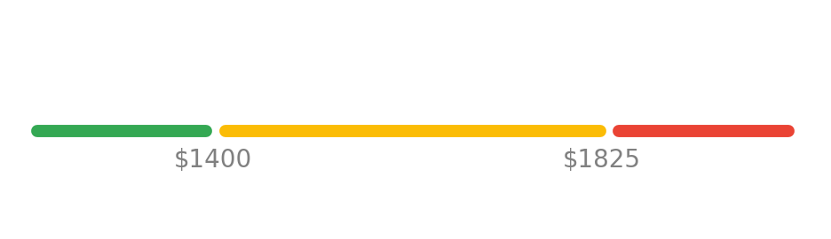

## Gimme Shelter:
## Using Python to Find a Place to Live in Toronto

<!-- # 🐍 🔍 🏠 -->

<!--  -->

<!--  -->


**PyCon Canada - November 2019**

*Ian Whitestone*

note: example speakr notes!


<hr>
<p> 
    
    
</p>
<hr>
Today's slides 👉 [ianwhitestone.work/slides](https://ianwhitestone.work/slides/pycon-canada-2019.html)

---

## Some background..


#### `>>> df[df.bedrooms == 1].price.median()`

`$2,200` <!-- .element: class="fragment" --> 

 <!-- .element: class="fragment" --> 

note: xxx


#### `>>> df[df.bedrooms == 0].price.median()`

`$1,800` <!-- .element: class="fragment" --> 

 <!-- .element: class="fragment" --> 


#### `>>> df[df.housing_type == 'basement'].price.median()`

`$1,500` <!-- .element: class="fragment" --> 

 <!-- .element: class="fragment" --> 


## Not only is it expensive..

* constantly looking on multiple sites
* listings go really fast
* competitive applications
* bidding wars
* ...


## Maybe there's a better way?

Inspired by a simple San Francisco [apartment posting slack bot](https://www.dataquest.io/blog/apartment-finding-slackbot/) made by Vik Paruchuri...

---

## hello, domi


<center>
    <video controls="true" muted="true" height="700px" src="imgs/pycon-canada-2019/clips/full_demo_2.mp4"></video>
</center>

---

## Today's talk

* Quick overview of how it works & highlight some packages
* Deep dive into the price rank feature
* Lesson's learned

---

## Overview of domi


## All lambda functions are managed through Zappa


<hr>

*"Zappa makes it super easy to build and deploy server-less, event-driven Python applications (including, but not limited to, WSGI web apps) on AWS Lambda + API Gateway"*

note: First published in July 2016, packed with useful features


`zappa_settings.json` 

```json
{
    "web_scraper": {
        "project_name": "domi",
        "runtime": "python3.7",
        "s3_bucket": "domi",
        "events": [{
           "function": "main.run_my_program",
           "expression": "rate(1 hour)"
        }]
    }
}
```


```bash
→ zappa deploy web_scraper
Calling deploy for stage web_scraper..
Downloading and installing dependencies..
 - psycopg2-binary==2.8.3: Using locally cached manylinux wheel
 - sqlite==python3: Using precompiled lambda package
'python3.7'
Packaging project as zip.
Uploading zappa-domi-web-scraper-1569183776.zip (9.5MiB)..
100%|█████████████████████████████████████████| 9.97M/9.97M [00:21<00:00, 528KB/s]
Scheduling..
Scheduled zappa-domi-web-scraper.run with expression rate(1 hour)!
Deployment complete!
```


## Learn more about Zappa

* [github.com/Miserlou/Zappa](https://github.com/Miserlou/Zappa) 
* [Sean Coates - PyCon Canada 2017](https://www.youtube.com/watch?v=gSae_ZBBbkc)
* [ianwhitestone.work/slides/python-meetup-sept-2019.html](https://ianwhitestone.work/slides/python-meetup-sept-2019.html)


## Plenty of existing resources for scraping


## Web data is usually messy, and deeply nested

```
data = {
  "config": {
    "adData": {
      "price": {"amount": "2000000"},
      "title": "Gorgeous 2 Bed 2 Bath Fully Furnished Executive Condo",
      "description": "Stunning Executive Fully Furnished Lower Penthouse...",
      ...
      "media": [
        {
          "type": "image",
          "href": "https://i.ebayimg.com/00/s/NjAwWDgwMA==/z/BTsAAOSwhZhdpb8X/$_59.JPG",
        },
        ...
      ],
      "adLocation": {"latitude": 43.6500917, "longitude": -79.38737379999999},
      "adAttributes": [
        {
          "machineKey": "numberbedrooms",
          "machineValue": "2.5",
          ...
        }
        ...
      ],
      ...
  }
}
```


## And correspondingly, processing it is equally messy

```python
price = data["config"]["adData"]["price"]["amount"]
price = int(price) / 1000
latitude = data["config"]["adData"]["adLocation"]["latitude"]
longitude = data["config"]["adData"]["adLocation"]["longitude"]
imgs = [
    media["href"] for media in data["config"]
]
```


<div class="container">
    <div class="col">
        <h2> Enter glom </h2>
        [github.com/mahmoud/glom/](https://github.com/mahmoud/glom/)
        <br>
        ...a new approach to working with data in Python
    </div>
    <div class="col">
        
    </div>
</div>
<hr>

* Path-based access for nested structures <!-- .element: class="fragment" --> 
* Declarative data transformation using lightweight, Pythonic specifications <!-- .element: class="fragment" --> 
* Readable, meaningful error messages <!-- .element: class="fragment" --> 


```python
>>> from glom import glom

>>> data = {
    'config': {
        'adData': {
            'price': {'amount': '2000000'}
        },
        ...
    }
}
>>> glom(data, 'config.adData.price.amount')
'2000000'
```


```python
>>> from glom import glom

>>> data = {
    'config': {
        'adData': {
            'price': {'amount': '2000000'}
        },
        ...
    }
}
>>> glom(data, ('config.adData.price.amount', lambda x: int(x) / 1000))
2000
```


```python
>>> from glom import glom

>>> data = {
    'config': {
        'adData': {
            'price': {'amount': '2000000'}
        },
        "adLocation": {
            "latitude": 43.6500917, 
            "longitude": -79.38737379999999
        },
        ...
    }
}
>>> spec = {
    "price": ("config.adData.price.amount", lambda x: int(x)/1000),
    "latitude": "config.adData.adLocation.latitude",
    "longitude": "config.adData.adLocation.longitude"
}
>>> glom(data, spec)
{
    "price": 2000,
    "latitude": 43.6500917,
    "longitude": -79.38737379999999
}
```


* [PostGIS](https://postgis.net/) is a spatial database extender for [PostgreSQL](https://postgresql.org) object-relational database 
* It adds support for geographic objects allowing location queries to be run in SQL


## Run fast, powerful spatial queries

```sql
SELECT listings.*
FROM listings, user_regions
WHERE 
    ST_Contains(user_regions.geom, listings.geom)
    AND bedrooms >= 1
    AND bathrooms >= 1
    AND ...
```


```python
from geoalchemy2 import Geometry
from sqlalchemy import Column, Integer

class Listing(BASE):
    __tablename__ = "listings"

    id = Column(Integer, primary_key=True)
    geom = Column(Geometry(geometry_type="POINT", srid=4326))
    bedrooms = Column(Integer)

class UserRegion(BASE):
    __tablename__ = "user_regions"

    id = Column(Integer, primary_key=True)
    user_id = Column(Integer, ForeignKey("users.id"))
    geom = Column(Geometry(geometry_type="POLYGON", srid=4326))
```


```python
from models import Listing, UserRegion, SESSION
from sqlalchemy import func

listings = (
    SESSION.query(
        Listing.id,
        Listing.source,
        Listing.price,
        ...
    )
    .join(
        UserRegion,
        and_(
            UserRegion.user_id == 123,
            func.ST_Contains(UserRegion.geom, Listing.geom),
        ),
    )
```


## Python + Slack

* [api.slack.com](https://api.slack.com/)
* [github.com/slackapi/python-slackclient](https://github.com/slackapi/python-slackclient)

---

## Price Rank


## Motivation 
<hr>
*Is this apartment priced **high**? **normally**? **low**?*


**Goal:** Get an expected price distribution based on the type of apartment


## Option 1: Clustering
**Theory:** Cluster similar listings and use actual price distribution of cluster

<div>
    
    <br>
    [Source](https://www.mathworks.com/help/stats/kmeans.html)
</div>


## Key problem with this approach:

**Each variable is treated as having the same impact on price (after scaling)**


## Option 2: Linear Regression 
**Theory:** Linear regression to predict mean, calculate prediction interval to get range of expected values

<div> <!-- .element: class="fragment" --> 
    
    <br>
    [Source](https://apmonitor.com/che263/index.php/Main/PythonRegressionStatistics)
</div>


## However...

Calculating the prediction interval relies on the **homoscedasticity assumption**, which states that the variance around the regression line is the same for all values of the predictor variable.


We can quickly see this does not hold true..


## Option 3: Quantile Regression

**Theory:** Quantile regression to predict p25 & p75

<div> <!-- .element: class="fragment" --> 
    
    <br>
    [Source - statsmodels docs](https://www.statsmodels.org/dev/examples/notebooks/generated/quantile_regression.html)
</div>


<hr>

* Price falls between `p25` and `p75` --> **typical** <!-- .element: class="fragment" --> 

* Price falls below `p25` --> **low** <!-- .element: class="fragment" --> 

* Price falls above `p75` --> **high** <!-- .element: class="fragment" --> 


## Feature Engineering


We start with some standard features:
<hr>

* number of bedrooms, bathrooms
* size (sqft)
* is it furnished?
* unit type (apartment building, house, condo, basement, etc..)
* ...

<hr>

`price ~ bedrooms + bathrooms + size + is_furnished + ...`


## But how do we account for location?


## Area Encoding?

Automatically cluster each point into an "area"

```python
from sklearn.cluster import KMeans

X = df[['lat', 'long']].values
km = KMeans(20, init='k-means++')
km.fit(X)
clusters = km.predict(X) # classify points into 1 of 20 clusters
```

Note: could also use the maps API to get the actual neighborhood and then encode that


`price ~ bedrooms + bathrooms + size + is_furnished + ... + cluster_0 + cluster_1 + ...`


**Arbitrary boundaries result in similar points being treated differently**


## Nearest Neighbors 
#### 👪 🏠 ...?... 🏠 👪

<div> <!-- .element: class="fragment" --> 
    
    <br>
    [Source: Erik Bernhardsson's Fantastic Blog](https://erikbern.com/2015/10/01/nearest-neighbors-and-vector-models-part-2-how-to-search-in-high-dimensional-spaces.html)
</div>


* Retrieve X nearest apartments with same # of bedrooms
* Calculate mean, median, etc.
* Feed that in as a feature to our model

<hr>

<p> [annoy](https://github.com/spotify/annoy) (Approximate Nearest Neighbors Oh Yeah) </p><!-- .element: class="fragment" --> 

<p> (can also use [scikit-learn](https://scikit-learn.org/stable/modules/neighbors.html)) </p> <!-- .element: class="fragment" --> 


```python
>>> from annoy import AnnoyIndex

# build the tree
>>> featurees = ["lat_scaled", "long_scaled", "bedrooms_scaled"]
>>> tree = AnnoyIndex(len(features), "euclidean")
>>> for index, row in df[features].iterrows():
        tree.add_item(index, row.values)
>>> tree.build(10)

...

# search da tree
>>> apartment_index = 1 # index of apartment to search
>>> tree.get_nns_by_item(apartment_index, 51) # get 50 closest points
[1, 23412, 424, 794, 12, 939, 58, 3, ...]
```


`price ~ bedrooms + bathrooms + size + is_furnished + ... + nn_50_avg_price + ...`


## Displaying to users


## User design considerations

User's don't want a black box, otherwise they won't trust it. Give them context!
<hr>

*"$3,250 is normal"* <!-- .element: class="fragment" --> 

versus <!-- .element: class="fragment" --> 

*"$3,250 is typical for this type of listing. Listings with the same number of bedrooms, bathrooms and similar square footage and location typically have price ranges between $3,175 and $4,200"* <!-- .element: class="fragment" --> 

<hr> <!-- .element: class="fragment" --> 

<p> <!-- .element: class="fragment" --> 
Note the rounding...*"price ranges between $3,183.23 and $4,177.69"* just seems sketchy
</p>


**Giving users an easy way to visualize where the price falls also provides additional context**


## All ya need is a little...

 <!-- .element: class="fragment" --> 


```python
# normal (orange - middle) line
x = (lower, upper)
y = (1, 1)
ax.plot(x, y, linestyle="-", c="#FBBC06", linewidth=5.0, solid_capstyle="round")

# cheap (green - lower) line
x = (min_price, lower - spacing)
y = (1, 1)
ax.plot(x, y, linestyle="-", c="#34A853", linewidth=5.0, solid_capstyle="round")

# expensive (red - upper) line
x = (upper + spacing, max_price)
y = (1, 1)
ax.plot(x, y, linestyle="-", c="#EA4334", linewidth=5.0, solid_capstyle="round")
```


```python
# upper bound text
ax.text(upper - spacing * 2, 0.9925, f"${upper}", fontsize=10, c="gray")

# lower bound text
ax.text(lower - spacing * 2.75, 0.9925, f"${lower}", fontsize=10, c="gray")
```




```python
# price marker
ax.plot(
    price,
    1,
    marker="o",
    markersize=12,
    fillstyle="full",
    c="w",
    markeredgewidth=2.5,
    markeredgecolor="#1A73E8",
)
```


```python
# tooltip triangle marker
ax.plot(
    price,
    1.0038,
    marker="v",
    markersize=7,
    fillstyle="full",
    c="#1A73E8",
    markeredgewidth=0.5,
    markeredgecolor="#1A73E8",
)
```


```python
# rectangle textbox
rect = patches.FancyBboxPatch(
    xy=(rectangle_start, 1.0045),
    width=rectangle_width,
    height=0.0075,
    edgecolor="#1A73E8",
    facecolor="#1A73E8",
    joinstyle="round",
    capstyle="round",
    boxstyle=patches.BoxStyle("Round", pad=0.000, rounding_size=0),
)
ax.add_patch(rect)
```


```python
# price rank text
ax.text(
    text_start,
    1.0096,
    f"${display_price} is {price_rank}",
    fontsize=10,
    verticalalignment="top",
    c="w",
    fontweight="bold",
)
```


---

## Wrapping up...

* keep it stupid simple
* go build!

---

## Appendix


```python
import statsmodels.formula.api as smf

mod = smf.quantreg('foodexp ~ income', data) # uses patsy model formulas
res = mod.fit(q=.5)
print(res.summary())
```


### [aws.amazon.com/free](https://aws.amazon.com/free)


1 million requests & 400,000 GB-seconds per month [🙅💸]
<hr>

Could run a λ with 250MB of RAM for 18.5 days straight.. <!-- .element: class="fragment" --> 


## Validating results


## Model monitoring


[great expectations](https://github.com/great-expectations/great_expectations)
