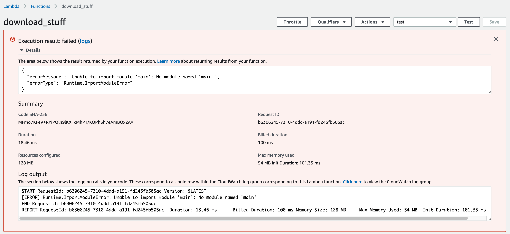
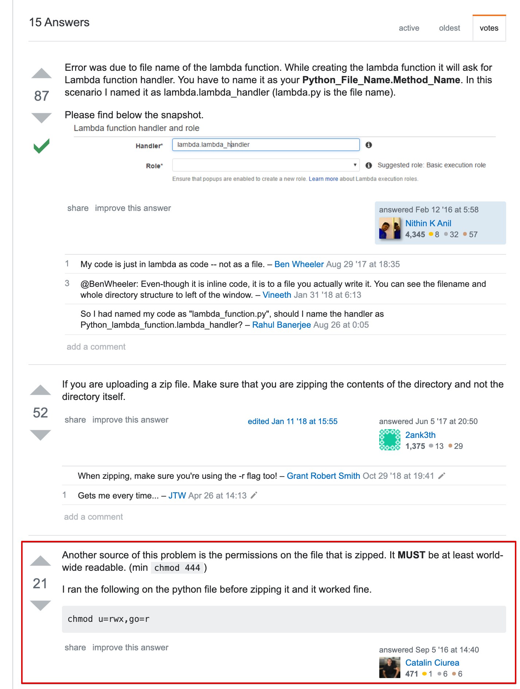
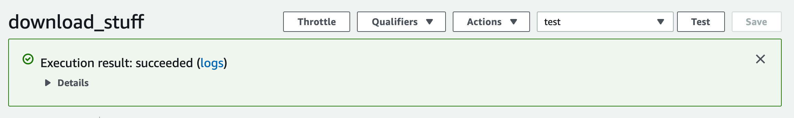
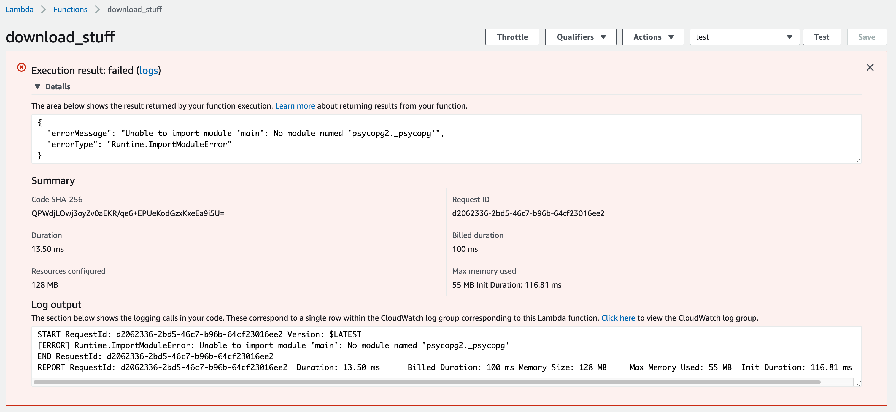

## Serverless Python with Zappa

<!--  -->

<!--  -->


**Toronto Python Meetup - September 2019**

*Ian Whitestone*

note: hey everyone, my name is Ian & I work on the data team at Shopify. today I am going to talk about a Python library called Zappa which makes doing serverless things 100 times easier. for the record, this has talk has nothing to do with Shopify or what I do at Shopify, but if people are curious about what type of stuff we do on the data team we should catch up after.


<hr>
<p> 
    
    
</p>

---

## Serverless

* ~~No servers~~ **No permanent servers you have to manage**...
* Instead, you just write code, and invoke that code on demand in many different ways...  <!-- .element: class="fragment" -->
* Like when an API endpoint is called <!-- .element: class="fragment" -->
* Or when a new file gets uploaded to your cloud storage <!-- .element: class="fragment" -->
* Or on a pre-determined schedule <!-- .element: class="fragment" -->

<!-- .element: class="fragment" --> ...and [more](https://aws.amazon.com/blogs/architecture/understanding-the-different-ways-to-invoke-lambda-functions/) 

note: serverless really means no permanent servers you have to manage. 


## Serverless Offerings

* Microsoft Azure --> [Azure Functions](https://azure.microsoft.com/en-ca/services/functions/)
* Google Cloud Platform (GCP) --> [Google Cloud Functions](https://cloud.google.com/functions/)
* IBM Cloud --> [IBM Cloud Functions](https://www.ibm.com/cloud/functions)
* Amazon Web Services (AWS) --> [AWS Lambda](https://aws.amazon.com/lambda/)
    * ☝️ <!-- .element: class="fragment" --> 


## Why?

*"Run code without thinking about servers. Pay only for the compute time you consume."* 

<p>- [AWS lambda homepage](https://aws.amazon.com/lambda/)</p>

note: if you're running Shopify or some other large business, serverless will end up costing you way more. but if you have a smaller web app or set of periodic jobs you want to run, it makes a lot of sense


### [aws.amazon.com/free](https://aws.amazon.com/free)


1 million requests & 400,000 GB-seconds per month [🙅💸]
<hr>

Could run a λ with 250MB of RAM for 18.5 days straight.. <!-- .element: class="fragment" --> 


---

## Serverless Python from Scratch

note: in order to appreciate zappa, or any other serverless framework, you need to understand what life is like without them. I'm going to really quickly show you some end to end examples of how you would get a lambda function set up from scratch. i'm gonna go quick, because you don't need to be able to remember all the details, you just need walk away with a high level understanding of what's involved and all the nuances


**Use Case:** Periodically download some data, save to cloud storage (S3)
<hr>
    
```bash
# Create virtualenv and install packages
→ pipenv install requests
```


`handler.py`

```python
import requests
import yaml

import main

def my_handler(event=None, context=None):
    """Kick off the desired function

    Parameters
    ----------
    event : dict, optional
        AWS Lambda uses this parameter to pass in event data to the handler
    context : LambdaContext, optional
        AWS Lambda uses this parameter to provide runtime information
        to your handler
    """

    main.do_stuff() # and things
```

note: every lambda function must accept some contextual information that AWS will automatically pass in when invoking your function. for our use case, we are just running an arbitrary function on a schedule, so we don't use any of this.


```bash
→ tree
├── Pipfile
├── Pipfile.lock
├── app
│   ├── main.py
│   └── handler.py
```


## Step 1: Build Deployment Package

* AWS lambda just provides a linux environment with python installed
* You need to upload any additional packages you need for your functions


```bash
→ pipenv run pip show requests
Name: requests
Version: 2.22.0
Summary: Python HTTP for Humans.
Home-page: http://python-requests.org
Author: Kenneth Reitz
Author-email: me@kennethreitz.org
License: Apache 2.0
Location: /Users/ianwhitestone/.../virtualenvs/.../lib/python3.7/site-packages 👈
Requires: idna, urllib3, certifi, chardet
Required-by: zappa
```


```bash
→ PACKAGES_DIR=/Users/ianwhitestone/.../virtualenvs/.../lib/python3.7/site-packages
→ PROJECT_DIR=$(pwd)
```


```bash
→ cd $PACKAGES_DIR
→ zip -r ${PROJECT_DIR}/deployment-package.zip .
...
→ cd ${PROJECT_DIR}/app
→ zip -r ${PROJECT_DIR}/deployment-package.zip .
```


## Step 2: Create Identity & Access Management (IAM) Role

* In AWS you use IAM roles to dictate what things a service or user has access to
* For our use case, the IAM role will describe all the other Amazon services our lambda function can interact with


```bash
→ aws iam create-role \
    --role-name lambda_basic_role \
    --assume-role-policy-document file://lambda_trust_policy.json
{
    "Role": {
        "Path": "/",
        "RoleName": "lambda_basic_role",
        "RoleId": "AROA......",
        "Arn": "arn:aws:iam::<account_num>:role/lambda_basic_role",
        "CreateDate": "2019-09-22T16:48:43Z",
        "AssumeRolePolicyDocument": {
            "Version": "2012-10-17",
            "Statement": [
                {
                    "Effect": "Allow",
                    "Principal": {
                        "Service": "lambda.amazonaws.com"
                    },
                    "Action": "sts:AssumeRole"
                }
            ]
        }
    }
}
```

note: first, we create our lambda function, and add a trust policy which says that the lambda service is allowed to use this IAM role


```bash
# Give it full access to S3
→ aws iam attach-role-policy \
    --role-name lambda_basic_role \
    --policy-arn arn:aws:iam::aws:policy/AmazonS3FullAccess

# And cloudwatch (logs)
→ aws iam attach-role-policy \
    --role-name lambda_basic_role \
    --policy-arn arn:aws:iam::aws:policy/CloudWatchFullAccess
```


## Step 3: Create Lambda Function


```bash
→ aws lambda create-function \
    --function-name download_stuff \
    --runtime python3.7 \ 😎 
    --role arn:aws:iam::<account_num>:role/lambda_basic_role \
    --handler handler.my_handler \
    --zip-file fileb://../deployment-package.zip \
    --memory-size 128 \
    --timeout 900 # max timeout (15 minutes)
```


## Step 4: Create Cloudwatch Events to Trigger Lambda

* Think "cronjob"


```bash
# Run it every hour
aws events put-rule \
    --name "RunLambdaFunction" \
    --schedule-expression "rate(1 hour)" \
    --state "ENABLED"

# Add lambda function as target
aws events put-targets \
    --rule "RunLambdaFunction" \
    --targets "Id"="1","Arn"="arn:aws:lambda:us-east-1:<account_num>:function:download_stuff"
```


Test it out...


<hr>
 <!-- .element: class="fragment" --> 





```bash
→ chmod -R 755 $PACKAGES_DIR
→ chmod -R 755 $PROJECT_DIR
```


...rebuild our deployment packagement


```bash
→ aws lambda update-function-code \
    --function-name download_stuff \
    --zip-file fileb://../deployment-package.zip
```


Try again...
<hr>

 <!-- .element: class="fragment" --> 

 <!-- .element: class="fragment" --> 


**Use Case:** Periodically download some data, save to ~~cloud storage (S3)~~ database
<hr>

```bash
# Create virtualenv and install packages
→ pipenv install requests
→ pipenv install psycopg2 # new dependency!
```


...rebuild our deployment packagement

...update our lambda function


<hr>

 <!-- .element: class="fragment" --> 


* Lambda functions run on pre-configured [Amazon Linux machines](https://docs.aws.amazon.com/lambda/latest/dg/current-supported-versions.html)
* Certain libraries need to be pre-compiled on Amazon Linux <!-- .element: class="fragment" --> 
* Luckily, popular libraries are already pre-compiled <!-- .element: class="fragment" --> 
    * https://github.com/Miserlou/lambda-packages <!-- .element: class="fragment" --> 
    * https://github.com/jkehler/awslambda-psycopg2 <!-- .element: class="fragment" --> 
* Also some docker based solutions available <!-- .element: class="fragment" --> 
    * [How to claw your way out of AWS Lambda function hell using the power of Docker](https://www.freecodecamp.org/news/escaping-lambda-function-hell-using-docker-40b187ec1e48/) <!-- .element: class="fragment" --> 

note: certain libraries, like ones with c-extensions, need to be pre-compiled on Amazon linux


---

## Now let's talk about Zappa


<hr>

*"Zappa makes it super easy to build and deploy server-less, event-driven Python applications (including, but not limited to, WSGI web apps) on AWS Lambda + API Gateway"*

[github.com/Miserlou/Zappa](https://github.com/Miserlou/Zappa)

note: First published in July 2016, packaged with useful features


**Use Case:** Periodically download some data, save to database
<hr>

```bash
# Create virtualenv and install packages
→ pipenv install requests
→ pipenv install psycopg2
→ pipenv install zappa  # new dependency!
```


`zappa_settings.json` 

```json
{
    "dev": {
        "apigateway_enabled": false,
        "aws_region": "us-east-1",
        "profile_name": "default",
        "project_name": "download_stuff",
        "runtime": "python3.7",
        "s3_bucket": "download_stuff",
        "keep_warm": false,
        "events": [{
           "function": "main.do_stuff",
           "expression": "rate(1 hour)"
        }]
    },
    "prod": {
        // config for production
    }
}
```
(can be created step by step with `zappa init`)
note: no longer need separate handler.py. what's also cool, is you can configure a bunch of different microservices from one repo


```bash
→ zappa deploy dev
Calling deploy for stage dev..
Downloading and installing dependencies..
 - psycopg2-binary==2.8.3: Using locally cached manylinux wheel
 - sqlite==python3: Using precompiled lambda package
'python3.7'
Packaging project as zip.
Uploading zappa-cron-test-dev-1569183776.zip (9.5MiB)..
100%|█████████████████████████████████████████| 9.97M/9.97M [00:21<00:00, 528KB/s]
Scheduling..
Scheduled zappa-cron-test-dev-test.run with expression rate(1 minute)!
Deployment complete!
```


* Deployment package created ✅
    * pre-compiled Python packages (i.e. psycopg2) swapped out where necessary
* IAM role created ✅
* Lambda function created ✅
* Cloudwatch event created ✅


Easily view logs
<hr>

```bash
# Show all logs
→ zappa tail dev
Calling tail for stage dev..
[1569183806942] Instancing..
[1569183806943] [DEBUG] 2019-09-22T20:23:26.942Z 97e8-d0b23aaf17a0 Zappa Event: 
{'time': '2019-09-22T20:23:24Z', 'detail-type': 'Scheduled Event', 'source': 'aws.events', 
'region': 'us-east-1', 'detail': {}, 'version': '0', 
'resources': ['arn:aws:events:us-east-1:<>:rule/zappa-cron-test-dev-test.run'], 
'id': '75265076-af20-30ca-fd1e-b3fcbe478843', 'kwargs': {}}
[1569183806988] hello world!!
[1569183865861] [DEBUG] 2019-09-22T20:24:25.861Z 8064-931e09d761e6 Zappa Event: 
{'time': '2019-09-22T20:24:24Z', 'detail-type': 'Scheduled Event', 'source': 'aws.events', 
'region': 'us-east-1', 'detail': {}, 'version': '0', 
'resources': ['arn:aws:events:us-east-1:<>:rule/zappa-cron-test-dev-test.run'], 
'id': '823d2b37-6a85-c162-5084-1906492f4b93', 'kwargs': {}}
[1569183865861] hello world!!

# Show logs from specific timeframe
→ zappa tail dev --since 1m
```


Invoke raw commands on lambda for testing (avoid re-deploying)
<hr>

```bash
→ zappa invoke dev "import psycopg2; print('hello')" --raw
Calling invoke for stage dev..
[START] RequestId: e35516da-b71d-4452-9896-e622fe263d1f Version: $LATEST
Instancing..
[DEBUG] 2019-09-22T20:20:09.25Z e622fe263d1f Zappa Event: 
{'raw_command': "import psycopg2; print('hello')"}
hello
[END] RequestId: e35516da-b71d-4452-9896-e622fe263d1f
[REPORT] RequestId: e35516da-b71d-4452-9896-e622fe263d1f
Duration: 198.44 ms
Billed Duration: 200 ms
Memory Size: 512 MB
Max Memory Used: 84 MB
Init Duration: 525.29 ms

```


Keep lambda "warm" with scheduled invocations
<hr>

* on some requests AWS needs to re-provision a container with your code before it can process the request
* this can change response time from ~300 milliseconds to ~3 seconds 
    * [source](https://read.acloud.guru/how-to-keep-your-lambda-functions-warm-9d7e1aa6e2f0)
* known way around this is to implement a cloudwatch event that invokes your function every couple minutes
* zappa automatically takes care of this
    * default `{"keep_warm": true}` setting


## Many more features..
* Execute in response to other AWS events
* Easy rollbacks with `zappa rollback prod -n 1`
* Easy infra tear down with `zappa undeploy prod`
* and more...


## Other serverless frameworks

* [Serverless](https://github.com/serverless)
    * ⚠️ Written in Node.js
* [Chalice](https://github.com/aws/chalice)
    * Created by Amazon

note: there are some other options out there...

---

## Wrapping up...

* lambdas (aka cloud functions) are really awesome
* but setting them up, and managing your deployment packages is a HUGE pain in the ass <!-- .element: class="fragment" --> 
* zappa is pretty sweet <!-- .element: class="fragment" --> 
* so go build shit....and never worry about servers, AWS configurations or deployment packages again <!-- .element: class="fragment" --> 


## Additional Presentations & Reading

Todays slides 👉 [ianwhitestone.work/talks](https://ianwhitestone.work/slides/python-meetup-sept-2019.html)
<hr>

* [Sean Coates - PyCon Canada 2017](https://www.youtube.com/watch?v=gSae_ZBBbkc)
* [Jonatas Baldin - PyCon South Africa 2017](https://www.youtube.com/watch?v=1aggqfPzhNY)
* [Melvin L - Comparing Serverless Frameworks](https://www.youtube.com/watch?v=pj9vrE_UN4M)
* [Zappa vs. Chalice](https://blog.zappa.io/posts/comparison-zappa-verus-chalice)
