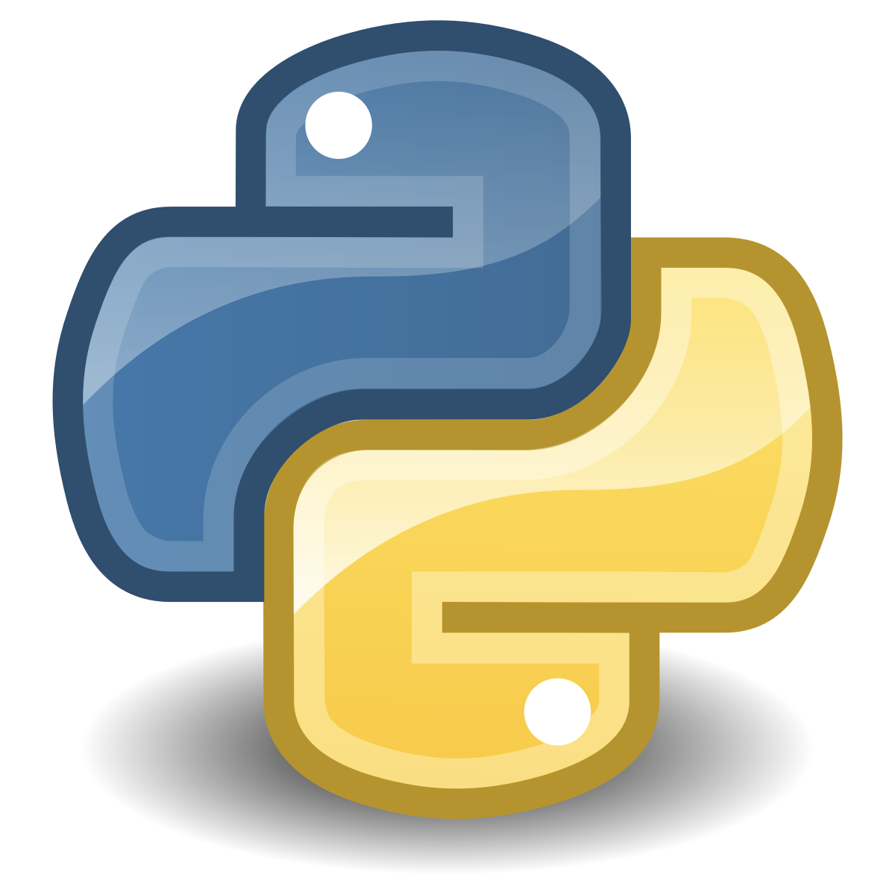
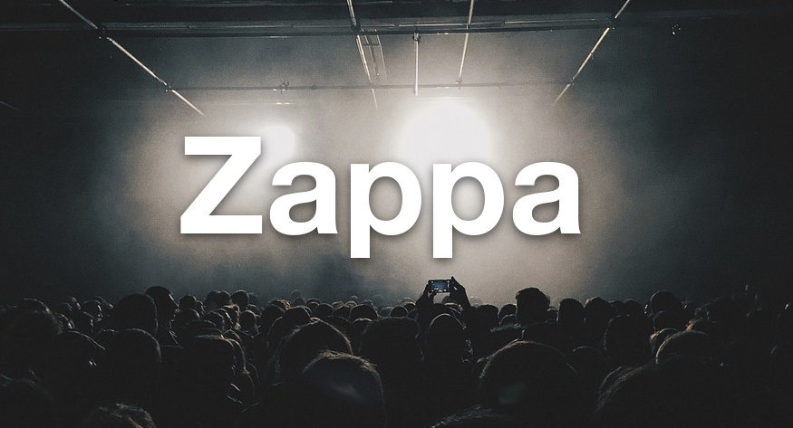

## Serverless Python w Zappa

<!--  -->

**Ian Whitestone**

**Toronto Python Meetup - September 2019**

👉 [ianwhitestone.work/slides](https://ianwhitestone.work/slides/python-meetup-sept-2019.html)

note:

* lambdas
* zappa

---

## Outline

* foo...  <!-- .element: class="fragment" -->
* bar...  <!-- .element: class="fragment" -->

---

## Additional Presentations & Reading

* [Sean Coates - PyCon Canada 2017](https://www.youtube.com/watch?v=gSae_ZBBbkc)
* [Jonatas Baldin - PyCon South Africa 2017](https://www.youtube.com/watch?v=1aggqfPzhNY)
* [Melvin L - Comparing Serverless Frameworks](https://www.youtube.com/watch?v=pj9vrE_UN4M)
* [Zappa vs. Chalice](https://blog.zappa.io/posts/comparison-zappa-verus-chalice)

