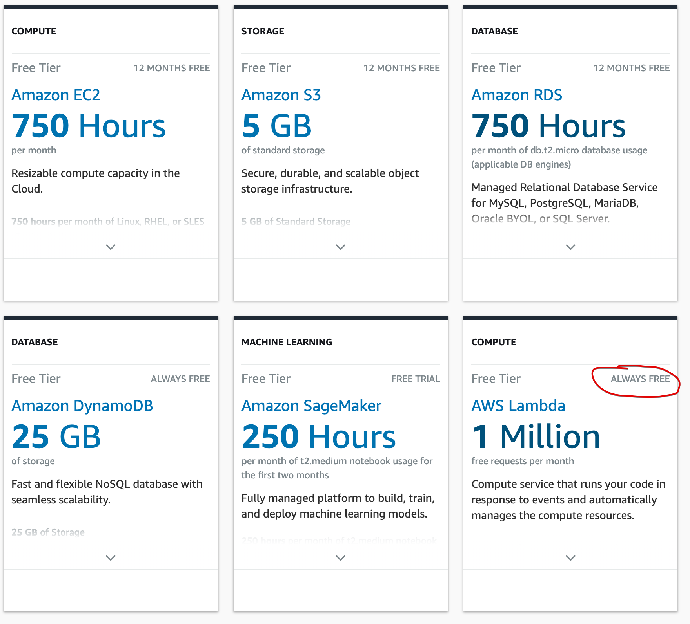
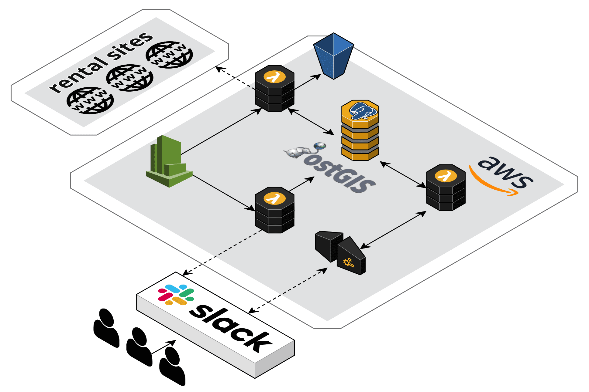
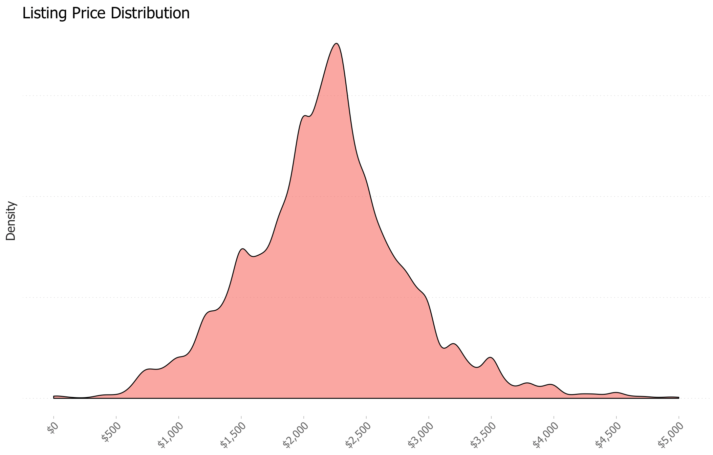
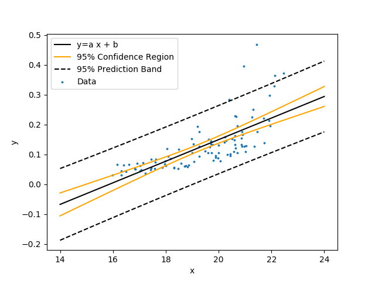
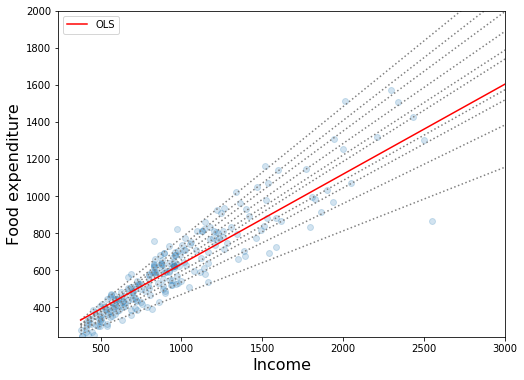
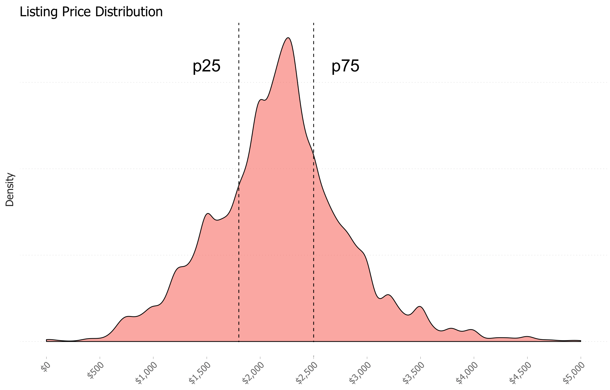
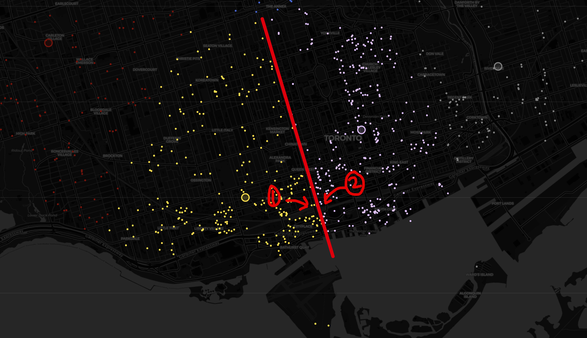
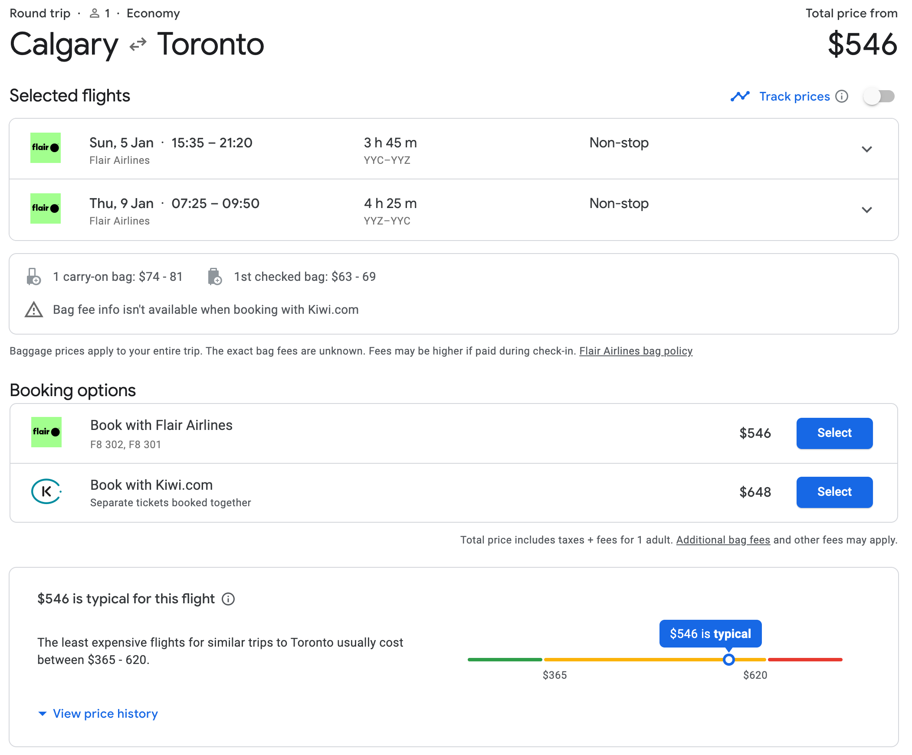
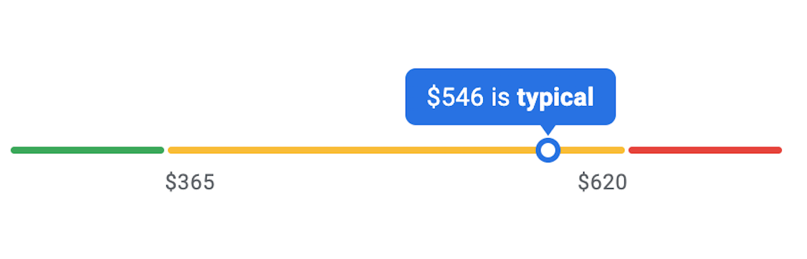
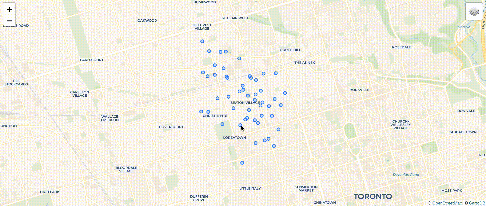

## Bootstrapping a data-driven application with Zappa

<!-- # 🐍 🔍 🏠 -->

<!--  -->


<!--  -->


**Serverless Toronto - February 2020**

*Ian Whitestone*

note: example speaker notes!


<hr>
<p> 
    
    
</p>
<hr>
Today's slides 👉 [ianwhitestone.work/talks](https://ianwhitestone.work/slides/pycon-canada-2019.html)

---

## Some background..


#### `>>> df[df.bedrooms == 1].price.median()`

`$2,200` <!-- .element: class="fragment" --> 

 <!-- .element: class="fragment" --> 

note: xxx


#### `>>> df[df.bedrooms == 0].price.median()`

`$1,800` <!-- .element: class="fragment" --> 

 <!-- .element: class="fragment" --> 


#### `>>> df[df.housing_type == 'basement'].price.median()`

`$1,500` <!-- .element: class="fragment" --> 

 <!-- .element: class="fragment" --> 


## Not only is it expensive..

* constantly looking on multiple sites
* listings go really fast
* competitive applications
* bidding wars
* ...


## Maybe there's a better way?

Inspired by a simple San Francisco [apartment posting slack bot](https://www.dataquest.io/blog/apartment-finding-slackbot/) made by Vik Paruchuri...

---

## hello, domi


<center>
    <video controls="true" muted="true" height="700px" src="imgs/pycon-canada-2019/clips/full_demo_2.mp4"></video>
</center>

---

## Today's talk

* Intro to serverless & zappa
* Overview of how domi works & highlight some packages
* Deep dive into the price rank feature
* Application monitoring with great expectations
* Serverless gotchas & workarounds

---

## Serverless

* ~~No servers~~ **No permanent servers you have to manage**...
* Instead, you just write code, and invoke that code on demand in many different ways...  <!-- .element: class="fragment" -->
* Like when an API endpoint is called <!-- .element: class="fragment" -->
* Or when a new file gets uploaded to your cloud storage <!-- .element: class="fragment" -->
* Or on a pre-determined schedule <!-- .element: class="fragment" -->

<!-- .element: class="fragment" --> ...and [more](https://aws.amazon.com/blogs/architecture/understanding-the-different-ways-to-invoke-lambda-functions/) 

note: serverless really means no permanent servers you have to manage. 


## Serverless Offerings

* Microsoft Azure --> [Azure Functions](https://azure.microsoft.com/en-ca/services/functions/)
* Google Cloud Platform (GCP) --> [Google Cloud Functions](https://cloud.google.com/functions/)
* IBM Cloud --> [IBM Cloud Functions](https://www.ibm.com/cloud/functions)
* Amazon Web Services (AWS) --> [AWS Lambda](https://aws.amazon.com/lambda/)
    * ☝️ <!-- .element: class="fragment" --> 


## Why?

*"Run code without thinking about servers. Pay only for the compute time you consume."* 

<p>- [AWS lambda homepage](https://aws.amazon.com/lambda/)</p>

note: if you're running Shopify or some other large business, serverless will end up costing you way more. but if you have a smaller web app or set of periodic jobs you want to run, it makes a lot of sense


### [aws.amazon.com/free](https://aws.amazon.com/free)




1 million requests & 400,000 GB-seconds per month [🙅💸]
<hr>

Could run a λ with 250MB of RAM for 18.5 days straight.. <!-- .element: class="fragment" --> 


## My Requirements

* No knowledge or maintenance of servers ✅ <!-- .element: class="fragment" -->
* Run periodic batch jobs ✅ <!-- .element: class="fragment" -->
* Respond to API requests ✅ <!-- .element: class="fragment" -->
* Cheap & easy compute ✅ <!-- .element: class="fragment" -->
* Support rapid development, interation & deployments ✅  <!-- .element: class="fragment" --> 
    * covered by Zappa...more on this later


---

## Serverless Python from Scratch

note: in order to appreciate zappa, or any other serverless framework, you need to understand what life is like without them. I'm going to really quickly show you some end to end examples of how you would get a lambda function set up from scratch. i'm gonna go quick, because you don't need to be able to remember all the details, you just need walk away with a high level understanding of what's involved and all the nuances


**Use Case:** Periodically download some data, save to cloud storage (S3)
<hr>
    
```bash
# Create virtualenv and install packages
→ pipenv install requests
```


`handler.py`

```python
import requests
import yaml

import main

def my_handler(event=None, context=None):
    """Kick off the desired function

    Parameters
    ----------
    event : dict, optional
        AWS Lambda uses this parameter to pass in event data to the handler
    context : LambdaContext, optional
        AWS Lambda uses this parameter to provide runtime information
        to your handler
    """

    main.do_stuff() # and things
```

note: every lambda function must accept some contextual information that AWS will automatically pass in when invoking your function. for our use case, we are just running an arbitrary function on a schedule, so we don't use any of this.


```bash
→ tree
├── Pipfile
├── Pipfile.lock
├── app
│   ├── main.py
│   └── handler.py
```


## Step 1: Build Deployment Package

* AWS lambda just provides a linux environment with python installed
* You need to upload any additional packages you need for your functions


```bash
→ pipenv run pip show requests
Name: requests
Version: 2.22.0
Summary: Python HTTP for Humans.
Home-page: http://python-requests.org
Author: Kenneth Reitz
Author-email: me@kennethreitz.org
License: Apache 2.0
Location: /Users/ianwhitestone/.../virtualenvs/.../lib/python3.7/site-packages 👈
Requires: idna, urllib3, certifi, chardet
Required-by: zappa
```


```bash
→ PACKAGES_DIR=/Users/ianwhitestone/.../virtualenvs/.../lib/python3.7/site-packages
→ PROJECT_DIR=$(pwd)
```


```bash
→ cd $PACKAGES_DIR
→ zip -r ${PROJECT_DIR}/deployment-package.zip .
...
→ cd ${PROJECT_DIR}/app
→ zip -r ${PROJECT_DIR}/deployment-package.zip .
```


## Step 2: Create Identity & Access Management (IAM) Role

* In AWS you use IAM roles to dictate what things a service or user has access to
* For our use case, the IAM role will describe all the other Amazon services our lambda function can interact with


```bash
→ aws iam create-role \
    --role-name lambda_basic_role \
    --assume-role-policy-document file://lambda_trust_policy.json
{
    "Role": {
        "Path": "/",
        "RoleName": "lambda_basic_role",
        "RoleId": "AROA......",
        "Arn": "arn:aws:iam::<account_num>:role/lambda_basic_role",
        "CreateDate": "2019-09-22T16:48:43Z",
        "AssumeRolePolicyDocument": {
            "Version": "2012-10-17",
            "Statement": [
                {
                    "Effect": "Allow",
                    "Principal": {
                        "Service": "lambda.amazonaws.com"
                    },
                    "Action": "sts:AssumeRole"
                }
            ]
        }
    }
}
```

note: first, we create our lambda function, and add a trust policy which says that the lambda service is allowed to use this IAM role


```bash
# Give it full access to S3
→ aws iam attach-role-policy \
    --role-name lambda_basic_role \
    --policy-arn arn:aws:iam::aws:policy/AmazonS3FullAccess

# And cloudwatch (logs)
→ aws iam attach-role-policy \
    --role-name lambda_basic_role \
    --policy-arn arn:aws:iam::aws:policy/CloudWatchFullAccess
```


## Step 3: Create Lambda Function


```bash
→ aws lambda create-function \
    --function-name download_stuff \
    --runtime python3.7 \ 😎 
    --role arn:aws:iam::<account_num>:role/lambda_basic_role \
    --handler handler.my_handler \
    --zip-file fileb://../deployment-package.zip \
    --memory-size 128 \
    --timeout 900 # max timeout (15 minutes)
```


## Step 4: Create Cloudwatch Events to Trigger Lambda

* Think "cronjob"


```bash
# Run it every hour
aws events put-rule \
    --name "RunLambdaFunction" \
    --schedule-expression "rate(1 hour)" \
    --state "ENABLED"

# Add lambda function as target
aws events put-targets \
    --rule "RunLambdaFunction" \
    --targets "Id"="1","Arn"="arn:aws:lambda:us-east-1:<account_num>:function:download_stuff"
```


Test it out...


<hr>
 <!-- .element: class="fragment" --> 


```bash
→ chmod -R 755 $PACKAGES_DIR
→ chmod -R 755 $PROJECT_DIR
```


...rebuild our deployment packagement


```bash
→ aws lambda update-function-code \
    --function-name download_stuff \
    --zip-file fileb://../deployment-package.zip
```


Try again...
<hr>

 <!-- .element: class="fragment" --> 

 <!-- .element: class="fragment" --> 


**Use Case:** Periodically download some data, save to ~~cloud storage (S3)~~ database
<hr>

```bash
# Create virtualenv and install packages
→ pipenv install requests
→ pipenv install psycopg2 # new dependency!
```


...rebuild our deployment packagement

...update our lambda function


<hr>

 <!-- .element: class="fragment" --> 


* Lambda functions run on pre-configured [Amazon Linux machines](https://docs.aws.amazon.com/lambda/latest/dg/current-supported-versions.html)
* Certain libraries need to be pre-compiled on Amazon Linux <!-- .element: class="fragment" --> 
* Luckily, popular libraries are already pre-compiled <!-- .element: class="fragment" --> 
    * https://github.com/Miserlou/lambda-packages <!-- .element: class="fragment" --> 
    * https://github.com/jkehler/awslambda-psycopg2 <!-- .element: class="fragment" --> 
* Also some docker based solutions available <!-- .element: class="fragment" --> 
    * [How to claw your way out of AWS Lambda function hell using the power of Docker](https://www.freecodecamp.org/news/escaping-lambda-function-hell-using-docker-40b187ec1e48/) <!-- .element: class="fragment" --> 

note: certain libraries, like ones with c-extensions, need to be pre-compiled on Amazon linux


---

## Now let's talk about Zappa


<hr>

*"Zappa makes it super easy to build and deploy server-less, event-driven Python applications (including, but not limited to, WSGI web apps) on AWS Lambda + API Gateway"*

[github.com/Miserlou/Zappa](https://github.com/Miserlou/Zappa)

note: First published in July 2016, packaged with useful features


**Use Case:** Periodically download some data, save to database
<hr>

```bash
# Create virtualenv and install packages
→ pipenv install requests
→ pipenv install psycopg2
→ pipenv install zappa  # new dependency!
```


`zappa_settings.json` 

```json
{
    "dev": {
        "apigateway_enabled": false,
        "aws_region": "us-east-1",
        "profile_name": "default",
        "project_name": "download_stuff",
        "runtime": "python3.7",
        "s3_bucket": "download_stuff",
        "keep_warm": false,
        "events": [{
           "function": "main.do_stuff",
           "expression": "rate(1 hour)"
        }]
    },
    "prod": {
        // config for production
    }
}
```
(can be created step by step with `zappa init`)
note: no longer need separate handler.py. what's also cool, is you can configure a bunch of different microservices from one repo


```bash
→ zappa deploy dev
Calling deploy for stage dev..
Downloading and installing dependencies..
 - psycopg2-binary==2.8.3: Using locally cached manylinux wheel
 - sqlite==python3: Using precompiled lambda package
'python3.7'
Packaging project as zip.
Uploading zappa-cron-test-dev-1569183776.zip (9.5MiB)..
100%|█████████████████████████████████████████| 9.97M/9.97M [00:21<00:00, 528KB/s]
Scheduling..
Scheduled zappa-cron-test-dev-test.run with expression rate(1 minute)!
Deployment complete!
```


* Deployment package created ✅
    * pre-compiled Python packages (i.e. psycopg2) swapped out where necessary
* IAM role created ✅
* Lambda function created ✅
* Cloudwatch event created ✅


For web apps, all of the above, and:
<hr>

* Create a new API Gateway resource ✅
* Automatically map API Gateway request to WSGI ✅
* Integrate with custom domain ✅


Easily view logs
<hr>

```bash
# Show all logs
→ zappa tail dev
Calling tail for stage dev..
[1569183806942] Instancing..
[1569183806943] [DEBUG] 2019-09-22T20:23:26.942Z 97e8-d0b23aaf17a0 Zappa Event: 
{'time': '2019-09-22T20:23:24Z', 'detail-type': 'Scheduled Event', 'source': 'aws.events', 
'region': 'us-east-1', 'detail': {}, 'version': '0', 
'resources': ['arn:aws:events:us-east-1:<>:rule/zappa-cron-test-dev-test.run'], 
'id': '75265076-af20-30ca-fd1e-b3fcbe478843', 'kwargs': {}}
[1569183806988] hello world!!
[1569183865861] [DEBUG] 2019-09-22T20:24:25.861Z 8064-931e09d761e6 Zappa Event: 
{'time': '2019-09-22T20:24:24Z', 'detail-type': 'Scheduled Event', 'source': 'aws.events', 
'region': 'us-east-1', 'detail': {}, 'version': '0', 
'resources': ['arn:aws:events:us-east-1:<>:rule/zappa-cron-test-dev-test.run'], 
'id': '823d2b37-6a85-c162-5084-1906492f4b93', 'kwargs': {}}
[1569183865861] hello world!!
```


Easily view logs
<hr>

```bash
# Show logs from specific timeframe
→ zappa tail dev --since 1m

# Show logs from specific timeframe and filter
→ zappa tail batch_secondary_us_east_1 --since 1d --filter "ERROR"
```


Invoke raw commands on lambda for testing (avoid re-deploying)
<hr>

```bash
→ zappa invoke dev "import psycopg2; print('hello')" --raw
Calling invoke for stage dev..
[START] RequestId: e35516da-b71d-4452-9896-e622fe263d1f Version: $LATEST
Instancing..
[DEBUG] 2019-09-22T20:20:09.25Z e622fe263d1f Zappa Event: 
{'raw_command': "import psycopg2; print('hello')"}
hello
[END] RequestId: e35516da-b71d-4452-9896-e622fe263d1f
[REPORT] RequestId: e35516da-b71d-4452-9896-e622fe263d1f
Duration: 198.44 ms
Billed Duration: 200 ms
Memory Size: 512 MB
Max Memory Used: 84 MB
Init Duration: 525.29 ms

```


Keep lambda "warm" with scheduled invocations
<hr>

* on some requests AWS needs to re-provision a container with your code before it can process the request
* this can change response time from ~300 milliseconds to ~3 seconds ([source](https://read.acloud.guru/how-to-keep-your-lambda-functions-warm-9d7e1aa6e2f0))
* known way around this is to implement a cloudwatch event that invokes your function every couple minutes
* zappa automatically takes care of this
    * default `{"keep_warm": true}` setting


Oversized lambda deployment packages
<hr>

* AWS currently limits Lambda zip sizes to 50 megabytes
    * If you have pandas, numpy **or** scipy, you will very quickly go over limit
* zappa automatically takes care of this
    * `{"slim_handler": true}`
* larger parts of deployment package uploaded to S3
* pulls down package and copies to `/tmp` directory at runtime
    * adds extra startup time, okay for a warm lambda function
    * not okay when responding to high traffic & more lambdas get spun up


## Many more features..
* Execute in response to other AWS events
* Easy rollbacks with `zappa rollback prod -n 1`
* Easy infra tear down with `zappa undeploy prod`
* Extensibility through custom callbacks
    * See example [here](https://ianwhitestone.work/Zappa-Zip-Callbacks/)
* and more...


## Other serverless frameworks

* [Serverless](https://github.com/serverless)
    * ⚠️ Written in Node.js
* [Chalice](https://github.com/aws/chalice)
    * Created by Amazon

note: there are some other options out there...


## Downsides


Not undergoing active development??
<hr>


* Vendor lock-in with AWS
* No support for AWS layers (yet)
* Pre-compiled dependencies support isn't great (changing soon)

---

## Overview of domi




```json
"app": {
    "app_function": "domi.app.app",
    "aws_region": "us-east-1",
    "slim_handler": false,
    "runtime": "python3.7",
    "certificate_arn": "arn:aws:acm:us-east-1:XXXXXX:certificate/XXXXXX",
    "domain": "domi.cloud",
    "keep_warm": true,
    "keep_warm_expression": "cron(0/3 12-4 ? * * *)",
    "timeout_seconds": 3,
},
```


```json
"batch_primary_us_east_1": {
    "slim_handler": false,
    "keep_warm": false,
    "aws_region": "us-east-1",
    "runtime": "python3.7",
    "events": [
        {
           "function": "domi.apartments.handlers.get_all_listings",
           "expression": "cron(0 */2 * * ? *)"
        },
        {
           "function": "domi.apartments.handlers.process_new_listings",
           "expression": "cron(15 */2 * * ? *)"
        },
        {
           "function": "domi.apartments.handlers.check_listing_statuses",
           "expression": "cron(15 */2 * * ? *)"
        },
    ],
    "timeout_seconds": 900,
}
```


* [PostGIS](https://postgis.net/) is a spatial database extender for [PostgreSQL](https://postgresql.org) object-relational database 
* It adds support for geographic objects allowing location queries to be run in SQL


## Run fast, powerful spatial queries

```sql
SELECT listings.*
FROM listings, user_regions
WHERE 
    ST_Contains(user_regions.geom, listings.geom)
    AND bedrooms >= 1
    AND bathrooms >= 1
    AND ...
```


```python
from geoalchemy2 import Geometry
from sqlalchemy import Column, Integer

class Listing(BASE):
    __tablename__ = "listings"

    id = Column(Integer, primary_key=True)
    geom = Column(Geometry(geometry_type="POINT", srid=4326))
    bedrooms = Column(Integer)

class UserRegion(BASE):
    __tablename__ = "user_regions"

    id = Column(Integer, primary_key=True)
    user_id = Column(Integer, ForeignKey("users.id"))
    geom = Column(Geometry(geometry_type="POLYGON", srid=4326))
```


```python
from models import Listing, UserRegion, SESSION
from sqlalchemy import func

listings = (
    SESSION.query(
        Listing.id,
        Listing.source,
        Listing.price,
        ...
    )
    .join(
        UserRegion,
        and_(
            UserRegion.user_id == 123,
            func.ST_Contains(UserRegion.geom, Listing.geom),
        ),
    )
```


---

## Price Rank


## Motivation 
<hr>
*Is this apartment priced **high**? **normally**? **low**?*


**Goal:** Get an expected price distribution based on the type of apartment




## Option 1: Clustering
**Theory:** Cluster similar listings and use actual price distribution of cluster

<div>
    
    <br>
    [Source](https://www.mathworks.com/help/stats/kmeans.html)
</div>


## Key problem with this approach:

**Each variable is treated as having the same impact on price (after scaling)**


## Option 2: Linear Regression 
**Theory:** Linear regression to predict mean, calculate prediction interval to get range of expected values

<div> <!-- .element: class="fragment" --> 
    
    <br>
    [Source](https://apmonitor.com/che263/index.php/Main/PythonRegressionStatistics)
</div>


## However...

Calculating the prediction interval relies on the **homoscedasticity assumption**, which states that the variance around the regression line is the same for all values of the predictor variable.


We can quickly see this does not hold true..


## Option 3: Quantile Regression

**Theory:** Quantile regression to predict p25 & p75

<div> <!-- .element: class="fragment" --> 
    
    <br>
    [Source - statsmodels docs](https://www.statsmodels.org/dev/examples/notebooks/generated/quantile_regression.html)
</div>





<hr>

* Price falls between `p25` and `p75` --> **typical** <!-- .element: class="fragment" --> 

* Price falls below `p25` --> **low** <!-- .element: class="fragment" --> 

* Price falls above `p75` --> **high** <!-- .element: class="fragment" --> 


## Feature Engineering


We start with some standard features:
<hr>

* number of bedrooms, bathrooms
* size (sqft)
* is it furnished?
* unit type (apartment building, house, condo, basement, etc..)
* ...

<hr>

`price ~ bedrooms + bathrooms + size + is_furnished + ...`


## But how do we account for location?


## Area Encoding?

Automatically cluster each point into an "area"

```python
from sklearn.cluster import KMeans

X = df[['lat', 'long']].values
km = KMeans(20, init='k-means++')
km.fit(X)
clusters = km.predict(X) # classify points into 1 of 20 clusters
```

Note: could also use the maps API to get the actual neighborhood and then encode that


`price ~ bedrooms + bathrooms + size + is_furnished + ... + cluster_0 + cluster_1 + ...`


**Arbitrary boundaries result in similar points being treated differently**




## Nearest Neighbors 
#### 👪 🏠 ...?... 🏠 👪

<div> <!-- .element: class="fragment" --> 
    
    <br>
    [Source: Erik Bernhardsson's Fantastic Blog](https://erikbern.com/2015/10/01/nearest-neighbors-and-vector-models-part-2-how-to-search-in-high-dimensional-spaces.html)
</div>


* Retrieve X nearest apartments with same # of bedrooms
* Calculate mean, median, etc.
* Feed that in as a feature to our model

<hr>

<p> [annoy](https://github.com/spotify/annoy) (Approximate Nearest Neighbors Oh Yeah) </p><!-- .element: class="fragment" --> 

<p> (can also use [scikit-learn](https://scikit-learn.org/stable/modules/neighbors.html)) </p> <!-- .element: class="fragment" --> 


```python
>>> from annoy import AnnoyIndex

# build the tree
>>> featurees = ["lat_scaled", "long_scaled", "bedrooms_scaled"]
>>> tree = AnnoyIndex(len(features), "euclidean")
>>> for index, row in df[features].iterrows():
        tree.add_item(index, row.values)
>>> tree.build(10)

...

# search da tree
>>> apartment_index = 1 # index of apartment to search
>>> tree.get_nns_by_item(apartment_index, 51) # get 50 closest points
[1, 23412, 424, 794, 12, 939, 58, 3, ...]
```


`price ~ bedrooms + bathrooms + size + is_furnished + ... + nn_50_avg_price + ...`


## Better handling for remote apartments (outskirts)


Add exponentially decayed weighting to each point based on distance


```json
"price_rank_primary": {
    "project_name": "domi",
    "slim_handler": true,
    "memory_size": 3000,
    "apigateway_enabled": false,
    "keep_warm": false,
    "aws_region": "us-east-1",
    "runtime": "python3.7",
    "events": [
        {
           "function": "domi.apartments.price_rank.price_rank",
           "expression": "cron(0 */2 * * ? *)"
        }
    ],
    "timeout_seconds": 900,
},
```


## Displaying to users





## User design considerations

User's don't want a black box, otherwise they won't trust it. Give them context!
<hr>

*"$3,250 is normal"* <!-- .element: class="fragment" --> 

versus <!-- .element: class="fragment" --> 

*"$3,250 is typical for this type of listing. Listings with the same number of bedrooms, bathrooms and similar square footage and location typically have price ranges between $3,175 and $4,200"* <!-- .element: class="fragment" --> 

<hr> <!-- .element: class="fragment" --> 

<p> <!-- .element: class="fragment" --> 
Note the rounding...*"price ranges between $3,183.23 and $4,177.69"* just seems sketchy
</p>


**Giving users an easy way to visualize where the price falls also provides additional context**




## All ya need is a little...

 <!-- .element: class="fragment" --> 


---

## Monitoring with Great Expectations


**Is everything is going as expected?**
<hr>

* traditional error monitoring is not sufficient
* domi is a messy, data-heavy application
* multiple different processes running

note: ingesting listings from various sources, re-checking listing statuses, feeding listing data through machine learning models


**Application performance can be diagnosed by checking data**
<hr>

* Are we getting the expected amount of listings each day? From each source?
* Are we seeing the expected amount of missing values in each column?
    * parking, laundry, sqft, housing type, etc..
    * sudden spike in % missing could indicate website change
* Is the price rank model performing as expected?
    * 25% "low", 50% "normal", 25% "high"


## Enter Great Expectations

[github.com/great-expectations](https://github.com/great-expectations/great_expectations)
<hr>

* Framework for writing tests for data
    * validate dataset against our "expectations"
* Run checks on datasets:
    * at beginning/end of pipelines
    * before feeding into machine learning model
    * periodically, on-schedule


## Types of Expectations

* `expect_column_values_to_not_be_null`
* `expect_column_values_to_match_regex`
* `expect_column_values_to_be_unique`
* `expect_column_values_to_match_strftime_format`
* `expect_table_row_count_to_be_between`
* `expect_column_median_to_be_between`
*  ...and [many more](https://docs.greatexpectations.io/en/latest/expectation_glossary.html)


## Example: Validating Row Counts


## Example: Validating Row Counts

`expectations.json`
<hr>

```json
{
  "data_asset_name": "yesterdays_craigslist_listings",
  "expectation_suite_name": "default",
  "expectations": [
    {
      "expectation_type": "expect_table_row_count_to_be_between",
      "kwargs": {
        "min_value": 300
      }
    }
  ],
}
```


`run_data_checks.py`
<hr>

```python
from domi.db import DB_ENGINE
from great_expectations.dataset import SqlAlchemyDataset

sql_query = """
    SELECT id
    FROM {tablename}
    WHERE TRUE
        AND DATE_TRUNC('day', created_at) = CURRENT_DATE - INTERVAL '1' DAY
"""

new_sql_dataset = SqlAlchemyDataset(custom_sql=sql_query, engine=db_engine)
validation_results = new_sql_dataset.validate(expectation_suite="expectations.json")

if validation_results["success"]:
    ...
```


## Example: Model Monitoring with Distributional Expectations


---

## Serverless Gotchas and Workarounds


## Gotcha 1: Shared SESSION object

```python
from domi.handlers import process_new_listings
from domi.db import SESSION

# 👆everything instantiated above here is shared across future function invocations
def lambda_handler(event, context):
    process_new_listings()
```

* Objects instantiated on import are shared across function invocations <!-- .element: class="fragment" --> 
    * they only get reset during a cold start
* If one transaction fails, all subsequent transactions in other invocations will start failling <!-- .element: class="fragment" --> 


## Workaround

```python
# Automatically ensure all transactions are succesfully committed, 
# or rolled back if not
def commit_session(_raise=True):
    if not SESSION:
        return
    try:
        SESSION.commit()
    except Exception as e:
        SESSION.rollback()
        if _raise:
            raise

def session_committer(func):
    def wrapper(*args, **kwargs):
        try:
            return func(*args, **kwargs)
        finally:
            commit_session()

    return wrapper

# Use decorator on any function doing database transactions
@session_committer
def process_new_listings():
    ...
```

[Source - blog.brianz.bz](http://blog.brianz.bz/post/serverless-how-to-handle-db-transactions/)


## Gotcha 2: Slim handler kills performance on cold starts

* `{"slim_handler": true}` saves deployment package to S3
    * I need this because some of my processes rely on pandas, numpy, scipy
* pulls down package and copies to `/tmp` directory at runtime
* For a warm lambda function, this only happens once, and we are okay <!-- .element: class="fragment" --> 
* When traffic spikes, AWS autoscales and starts spinning up more lambdas <!-- .element: class="fragment" --> 
    * all of these go through cold start
    * must pull down and unzip >100 MB file from S3 


## Workaround

* Zappa allows custom Python functions to be invoked at different stages of the deployment process
* Build a custom `zip` callback to remove large packages from deployment packages

```json
"callbacks": { // Call custom functions during the local Zappa deployment/update process
    "settings": "my_app.settings_callback", // After loading the settings
    "zip": "my_app.zip_callback", // After creating the package
    "post": "my_app.post_callback", // After command has executed
}
```


## Workaround

```json
"app": {
    "app_function": "domi.app.app",
    "aws_region": "us-east-1",
    "runtime": "python3.7",
    "certificate_arn": "arn:aws:acm:us-east-1:XXXXXX:certificate/XXXXXX",
    "domain": "domi.cloud",
    "keep_warm": true,
    "keep_warm_expression": "cron(0/3 12-4 ? * * *)",
    "timeout_seconds": 3,

    // updated settings
    "slim_handler": false,
    "regex_excludes": [
        "pandas", "scipy", "numpy", "PIL", "statsmodels", "matplotlib"
    ],
    "callbacks": {
        "zip": "zappa_package_cleaner.main"
    },
},
```

See [blog post](https://ianwhitestone.work/Zappa-Zip-Callbacks/) for more details.


## Gotcha 3: Adding new, pre-compiled packages

* [annoy](https://github.com/spotify/annoy) has precompiled C-extensions
* Not all packages are available in [Miserlou/lambda-packages](https://github.com/Miserlou/lambda-packages)
* No new ones are being added


## Workaround
#### (⚠️ hackiness follows)

* Spin up EC2 with Amazon Linux AMI
* Install annoy and build compiled dependencies
* Save compiled package to repo

```python
try:
    # when running locally this will import succesfully
    # when running on lambda, this will fail and fallback to pre-compiled version
    from annoy import AnnoyIndex
except:
    from lambda_annoy import AnnoyIndex
```


## Workaround (long term)
In the (*hopefully not too distant*) future, zappa will support deployment package creation with docker.
<hr>
Workarounds are available, see [here](https://github.com/Miserlou/zappa-blog/blob/master/posts/docker-zappa-and-python3.md)

---

## Wrapping up...

* Zappa & serverless let me focus on differentiating factors
* I didn't have to worry about: <!-- .element: class="fragment" --> 
    * AWS configuration headaches (no api gateway)
    * Configuring ELBs and more servers

---

## Appendix


## Deploying with Github Actions

[ianwhitestone.work/AWS-Serverless-Deployments-With-Github-Actions](https://ianwhitestone.work/AWS-Serverless-Deployments-With-Github-Actions/)


```python
import statsmodels.formula.api as smf

mod = smf.quantreg('foodexp ~ income', data) # uses patsy model formulas
res = mod.fit(q=.5)
print(res.summary())
```



